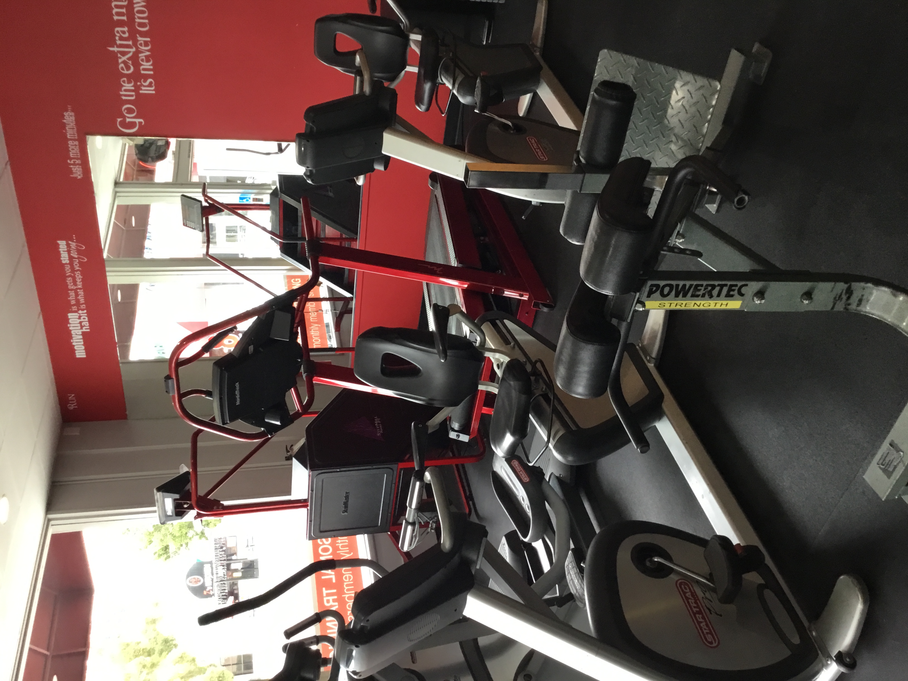

Development Fitness Gym makes it easy for anyone to get started. Whether you are a competitive bodybuilder, or someone that's just looking to get in shape, this gym is the one for you.

Our mission is simple..be apart of a worldwide movement that’s helps create better healthier lifestyles for people around the world. Whether your goal is weight loss, muscle building, competition preparation, nutritional knowledge, strength training, sports performance and enhancement, maybe just taking your health to levels it’s never been before, getting back to your high school shape, post pregnancy fitness or total life transformation, we got you covered. Here at Devolpment Fitness we understand the times we are living in. Over 80% of Americans are considered overweight or obese, which both can lead to health problems such as high blood pressure, diabetes, high cholesterol, coronary artery disease, back pain, knee pain to name a few. 

And to be quite honest it stems from a lack of knowledge. Most people have no idea what they should be doing health wise. We have so much access now and days you can literally find anything on the Internet (Anything!) but why are people still struggling to reach their goals? Most people don’t know what their goals are or why they even want them to begin with. Majority of people don’t understand that everyone is different and no two people are the same which means what works for me might not work for you and lastly most people don’t know what they need. Meaning is it accountability? Lack of knowledge? Professional guidance? Does the gym intimidate you and you want someone that can show you how to get in do what you have to do and get out? Do you keep telling yourself tomorrow? Do you claim to never have time? Whatever it is we want to meet you right where you are currently at. 

We want to help people not only better their health and reach fitness goals but create a lifestyle that changes them from the inside out. Do you have digestive issues? Are you finding it hard to stay asleep all night? Do you get random body pains throughout the day? Are you getting sick often? Do you crash everyday around the same time while at work? All of these signs can be from poor eating habits, not eating enough, overeating, nutrient deficiencies, living a sedentary lifestyle, not drinking enough water or even stress. Many of these problems create hormone imbalances, which them make it hard for your body to change or see any physical results. At Development Fitness we are a team of knowledgeable personal trainers and fitness professionals that dedicate ourselves to helping clients become the best version of themselves through health, fitness personal development and lifestyle changes. Let us help you take back control of your health today..we look forward to a journey with you. 

Call today! (323) 620-6247
